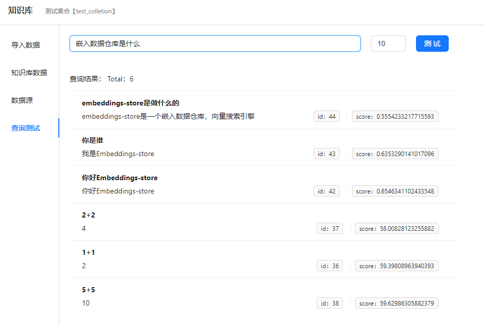

# embeddings-store

向量搜索引擎，用于存储向量，提供向量导入、检索等功能

## 快速开始

1. 安装docker、docker-compose    
   请参考 ：https://docs.docker.com/engine/install/
2. 下载 `./docker/start/docker-compose.yaml` 到你的服务器上    
   比如保存到 `~/em-store/` 目录下
3.  修改 `docker-compose.yaml` 对应的环境变量
    比如数据库密码、数据库文件保存路径、数据库连接地址等等
4. 启动`em-store`
```shell
cd ~/em-store/
sudo docker-compose up -d
```
5. 访问    
浏览器打开： `http://{服务器ip}:8006/`    
默认登录账号密码：`admin`/`123456`   


